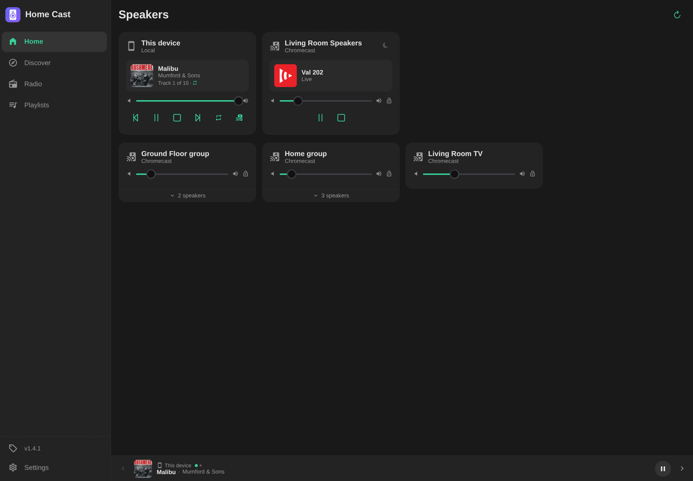
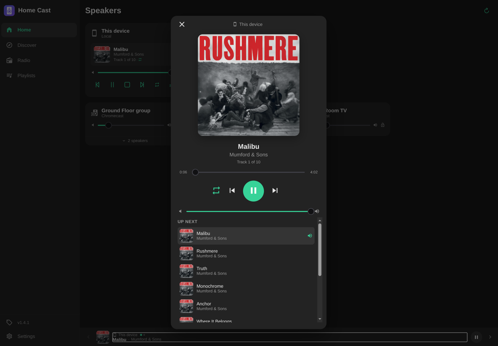
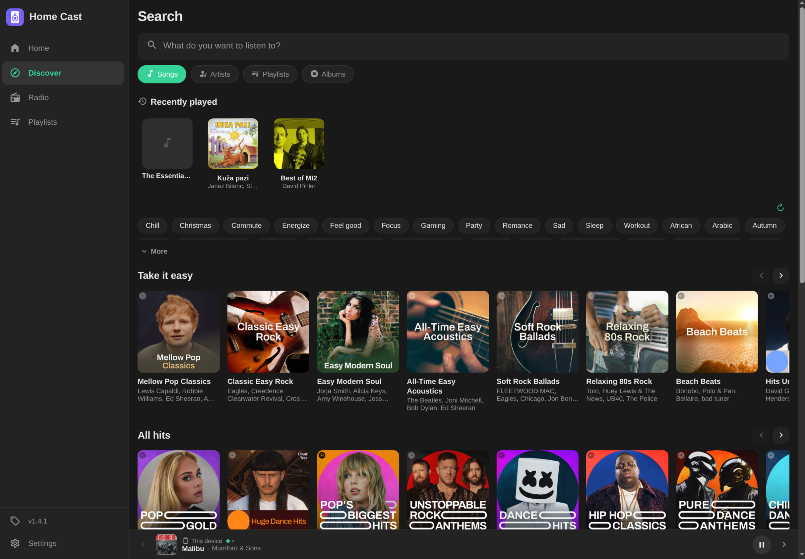

# Home-Cast

A self-hosted home audio controller with a Vue 3 UI. Controls **Chromecast** and **Sonos** speakers — search and play music from YouTube Music, stream radio stations, manage playlists, and trigger notification sounds.

## Features

- **Multi-device support** — Chromecast (audio & video), Sonos, and **local play** (your browser/phone as a speaker)
- **YouTube Music** — search songs, artists, albums, playlists; play with automatic queuing and background download
- **Discover** — YouTube Music home feed and mood/genre browsing, cached for instant loads
- **Radio** — search via Radio Browser API, play live streams
- **Saved playlists** — create and manage local playlists, with author and cover art
- **Alarms** — schedule music or radio on any speaker at a set time (weekdays or one-shot), with optional volume and fade-in; runs server-side
- **Now Playing** — full-screen view with album art, scrubbable progress (local play), and the upcoming queue
- **Queue** — shuffle, repeat (off / all / one), next / prev, sleep timer, playlist browser, transfer to another speaker (or the browser)
- **Notification sound** — interrupt playback with a sound clip, then resume from the same position
- **Installable PWA** — add to your home screen with an offline-ready app shell
- **Real-time UI** — WebSocket state updates every 3 seconds
- **Mobile-friendly** Vue 3 + PrimeVue UI

<p align="center">
  
  
  
</p>

## Changelog

### v1.6.0 — 2026-07-18
- **Alarms**: schedule music or radio to start on any speaker at a set time, on chosen weekdays or as a one-shot, with optional starting volume and fade-in
- Alarms run on the server, so they fire even when no browser or phone app is open
- **Skip works when casting from the YouTube Music app**: next/previous now control whatever cast app owns the speaker, and the buttons enable only when that session actually supports skipping
- The custom receiver now advertises skip support, so next/previous are no longer grayed out in the Google Home app and notification controls
- Tap the now-playing track on a speaker card to open the full-screen player (instead of an inline list)
- Full-screen player: cover art shrinks when you scroll the queue so it no longer takes half the screen, and the transport controls are centered on play/pause
- Cover art falls back to the playlist cover across the full-screen player, speaker cards, and the TV receiver when a song's own artwork is missing or fails to load
- Fixed casting a saved playlist with a stored cover breaking playback (the embedded cover overflowed the Chromecast message and dropped the connection)

### v1.5.1 — 2026-07-11
- Fixed the Discover tab freezing the browser in production — a render loop in the feed's scroll-position tracking spun the main thread (masked in development by Vue's recursive-update guard)

### v1.5.0 — 2026-07-11
- **Local play**: your browser is now a speaker — pick **This device** to play music directly in the browser/phone alongside Chromecast and Sonos
- Transfer playback between the browser and any speaker **in both directions**, keeping the queue and current track
- New full-screen **Now Playing** view with album art, a scrubbable progress bar (local play), volume, and the upcoming queue
- **Installable PWA**: add Home Cast to your home screen with an app icon and offline-ready app shell
- Discover feed and mood data are **cached** (default 15 min, configurable via `cache.discover_ttl`) and pre-warmed on app open, so opening Discover is instant instead of hitting YouTube Music every time
- **Refresh** button on Discover to force-reload the home feed and moods, bypassing the cache
- Missing/broken song cover art now falls back to the album or playlist cover
- Saved playlists now store the **author** and **cover**, shown on the playlist list and detail views
- Saving a playlist keeps the cover you saw (album/playlist artwork), stored as base64 so it loads without re-fetching
- Search now remembers your query in the URL, so the **back button** returns you to your results instead of Discover

### v1.4.1 — 2026-07-11
- Fixed saved-playlist pre-warm spawning one download per track at startup, which could launch dozens of concurrent `yt-dlp`/`ffmpeg` processes and exhaust host memory (crashing Docker on low-RAM servers/NAS)
- Pre-warm downloads now run one at a time through a single background worker, matching playback behavior
- `docker-compose.yaml` now pins the current image tag and sets a memory limit so a transcode spike can't take down the host

### v1.4.0 — 2026-07-11
- Discover: new home feed on the Search tab with YouTube Music rows (New releases, All hits, Today's biggest hits, and more) as horizontal card carousels
- Mood & genre chips to browse curated playlists, with a wrap-to-fit layout and a **More** toggle
- Control all speakers at once: pause/play/next/prev/stop now accept slug `all` and fan out to every device, tolerating per-device failures
- Saved playlists now show a cover image, fetched from the first track and stored with the playlist
- Saved-playlist songs are pinned in the cache and pre-warmed on save so playlists start playing instantly; orphaned tracks are evicted
- Volume slider shows a live percentage bubble while dragging
- Upgraded `ytmusicapi` to 1.12.1 and made mood browsing resilient to mixed song/playlist sections that previously errored

### v1.3.0 — 2026-07-11
- Custom Chromecast Receiver: queue is now managed natively on the device via Google Cast Application Framework v3
- Google Home, voice commands, and physical remotes can now control next/prev/pause
- Receiver displays album art, track info, progress bar, and upcoming queue on the TV screen
- New `cast_app_id` config option to specify your registered custom receiver app
- Removed shuffle toggle (shuffle is pre-shuffle only — reloads queue in new order)
- Notification sounds handled by the receiver (no more Python-side pause/resume logic)
- Queue state restored from receiver on reconnect via custom message namespace
- Simplified backend: Python sends queue once, CAF handles all advancement

### V1.2.0 - 2026-04-23
- Settings dialog with theme selector (light/dark/auto) and feature toggles
- Volume lock: lock a speaker's volume via UI or API
- Update banner: checks GitHub for new releases and shows indicator in sidebar
- Fixed group members list not updating correctly

### v1.1.0 — 2026-04-21
- Playlist panel: click now-playing track to browse and jump to any song
- Transfer queue to a different speaker mid-playback
- Play button restarts finished playlist from the beginning
- Group child players always visible when group is active for independent volume control
- Speakers with active playlists shown independently, not grouped
- Song prefetch on playlist/album/artist page load to reduce play delay
- Chromecast discovery is now forgiving: devices retained for 1 hour if missed by mDNS
- Version info and changelog displayed in sidebar

### v1.0.0 — 2026-04-17
- Initial public release
- Chromecast and Sonos support
- YouTube Music search, playlists, albums, artists
- Radio station browser with favorites
- Saved playlists, sleep timer, dark/light mode
- WebSocket real-time state updates

## Quick Start (Docker)

```bash
# 1. Pull and run
docker compose up -d

# 2. Open the UI
http://<your-server-ip>:5050
```

The container runs nginx (port 5050) serving the Vue UI and proxying API calls to the Flask backend (port 5000 internally).

## Configuration

Copy `config.yaml.example` to `config.yaml` (for local dev) or set the `APP_HOSTNAME` environment variable (for Docker):

```yaml
# config.yaml
hostname: "http://192.168.1.100:5000"   # LAN IP — speakers must reach this
port: 5000
cast_app_id: "87584FFE"                 # custom Chromecast receiver app ID
cache:
  ttl: 3600           # seconds to keep downloaded audio
  dir: "./cache"
  discover_ttl: 900   # seconds to cache the Discover feed & moods (default 15 min)
```

> **Important:** `hostname` must be the LAN IP/hostname of your server, not `localhost`. Chromecast and Sonos devices fetch audio files directly from this URL.

### Custom Chromecast receiver (`cast_app_id`)

Chromecast playback uses a custom receiver app. Set `cast_app_id` to your registered receiver's application ID. You can either:

- **Use the public app ID `87584FFE`** — the receiver maintained for this project. No setup required; just set `cast_app_id: "87584FFE"` and go.
- **Register your own** — deploy the receiver from the `receiver/` folder to the [Google Cast Developer Console](https://cast.google.com/publish/), then use the application ID it assigns. See [`CustomReceiver.md`](CustomReceiver.md) for the full walkthrough.

If `cast_app_id` is left empty, the custom receiver is not launched — you lose the on-screen queue, album art, and external remote control (Google Home / voice / physical remotes).

### Docker environment variables

| Variable | Description |
|---|---|
| `APP_HOSTNAME` | Overrides `hostname` in config (e.g. `http://192.168.1.100:5050`) |
| `APP_PORT` | Overrides Flask port (default `5000`) |
| `APP_CACHE_DIR` | Overrides cache directory |

## API

All endpoints accept and return JSON.

### Devices

| Method | Path | Description |
|---|---|---|
| GET | `/get-devices` | List all discovered Chromecast & Sonos devices |
| POST | `/refresh-devices` | Force device rediscovery |
| POST | `/device/slug/play-url` | Play a URL on a device |
| POST | `/device/slug/pause` | Pause |
| POST | `/device/slug/resume` | Resume |
| POST | `/device/slug/stop` | Stop |
| POST | `/device/slug/next` | Next track |
| POST | `/device/slug/prev` | Previous track |
| POST | `/device/slug/volume` | Get volume |
| POST | `/device/slug/volume/set` | Set volume (0–1) |
| POST | `/device/slug/volume/delta` | Adjust volume by delta |
| POST | `/device/slug/shuffle` | Set shuffle on/off |
| POST | `/device/slug/repeat` | Set repeat mode (`off` / `all` / `one`) |
| POST | `/device/slug/sleep` | Set sleep timer (minutes) |
| POST | `/device/slug/state` | Get full device state |
| POST | `/device/slug/notify` | Play notification sound, then resume |

Device body always includes `{ "slug": "...", "type": "chromecast" | "sonos" }`.

#### Controlling all speakers at once

Pass `"slug": "all"` to a playback command (`pause`, `resume`, `stop`, `volume/set`,
`volume/delta`, `next`, `prev`, `repeat`, `sleep`, `notify`) to fan the action out to
every discovered device. `type` then acts as a filter: `"type": "sonos"` or
`"type": "chromecast"` limits the fan-out to that kind; omitting `type` (or `"type": "all"`)
targets everything.

The response is an aggregate, with one entry per device that never aborts on a single
failure:

```json
POST /device/slug/pause
{ "slug": "all" }

{ "results": [
  { "slug": "kitchen", "type": "chromecast", "ok": true, "result": { ... } },
  { "slug": "living_room", "type": "sonos", "ok": false, "error": "Device not found" }
] }
```

A single locked device (see volume lock) is reported as `"ok": false` and skipped rather
than blocking the rest. Read/single-only endpoints (`state`, `volume` GET, `play-url`,
`play-track`, volume `lock`/`unlock`) do not support `all`.

#### Notification sound example

```json
POST /device/slug/notify
{
  "slug": "living_room",
  "type": "chromecast",
  "soundUrl": "http://example.com/chime.mp3"
}
```

Pauses current music, plays the sound, then resumes from the same song and timestamp.

### Music

| Method | Path | Description |
|---|---|---|
| GET | `/music/search?q=&type=` | Search (type: `songs` / `artists` / `playlists` / `albums`) |
| POST | `/music/play` | Play song or YouTube Music playlist |
| GET | `/music/playlists` | List saved playlists |
| POST | `/music/playlists` | Create saved playlist |
| GET | `/music/playlists/<id>` | Get saved playlist |
| PUT | `/music/playlists/<id>` | Update saved playlist |
| DELETE | `/music/playlists/<id>` | Delete saved playlist |
| POST | `/music/playlists/<id>/play` | Play saved playlist |

Play body: `{ "slug", "type", "videoId" | "playlistId", "shuffle": false, "repeat": "off" }`

### Radio

| Method | Path | Description |
|---|---|---|
| GET | `/radio/search?q=` | Search radio stations |
| GET | `/radio/popular` | Popular stations |
| POST | `/radio/play` | Play a radio station |

### WebSocket

Connect to the server root with Socket.IO. The server emits a `states` event every 3 seconds (or immediately after any action) with a map of device states:

```json
{
  "living_room:chromecast": {
    "status": "PLAYING",
    "volume": 0.4,
    "queue": { "currentIndex": 2, "trackCount": 12, "shuffle": true, "repeat": "all" },
    "nowPlaying": { "title": "...", "thumbnail": "...", "contentId": "..." }
  }
}
```

## Local Development

```bash
# Backend
python -m venv venv
source venv/bin/activate
pip install -r requirements.txt
python run.py

# Frontend (separate terminal)
cd ui
npm install
npm run dev
```

The Vite dev server proxies `/api/` to the Flask backend automatically.

## Docker Build

```bash
docker build -t ghcr.io/pevecyan/home-cast:1.1.0 .
docker push ghcr.io/pevecyan/home-cast:1.1.0
```

## Requirements

- Python 3.12+
- Node 20+ (for UI build)
- ffmpeg (for yt-dlp audio extraction)
- Speakers must be on the same LAN as the server
